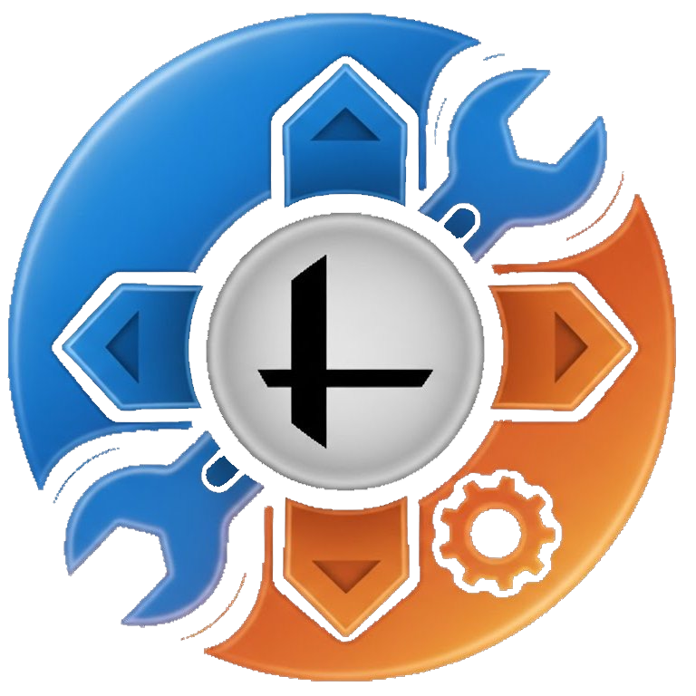

# Moveset Customizer

<p align="center">
  
</p>

A modern desktop application for managing Super Smash Bros Ultimate moveset mods. Built with Electron and React, featuring an intuitive dark-themed UI for customizing character slots.

## Features

- 🖱️ **Drag & Drop** - Intuitive interface for reordering slots
- 📦 **Import Skins** - Import skins from other mod folders with automatic file deduplication
- 🔄 **Replace Skins** - Replace existing skins while preserving slot order
- ✨ **Smart File Sharing** - Binary comparison automatically shares identical files
- 🗑️ **Disable/Enable Slots** - Temporarily disable slots without deleting them
- 📊 **Progress Tracking** - Visual progress bar for all operations
- 🖼️ **Alt Previews** - Automatic preview generation from UI files

## Installation

Download the latest `Moveset-Customizer-Portable.exe` from the [Releases](../../releases) page.

## Usage

### Loading a Mod

1. Launch the application
2. Click "Select Mod Folder" 
3. Navigate to your SSBU moveset mod folder (must contain a `config.json`)
4. The app will load all slots with their preview images

### Managing Slots

| Action | How to |
|--------|--------|
| **Reorder** | Drag and drop slots to change their order |
| **Disable** | Drag a slot to the "Disabled Slots" section |
| **Enable** | Drag a disabled slot back to the enabled section |
| **Import** | Click "Import Skins" and select another mod folder |
| **Replace** | In Import mode, use "Replace Mode" to swap existing skins |
| **Apply** | Click "Apply Changes" to save all modifications |

### Import Skins

1. Click "Import Skins" button
2. Select a mod folder containing skins to import
3. Drag skins from the import panel to your desired position
4. Click "Apply Import" to complete

The import system automatically:
- Detects and preserves file sharing from the source mod
- Compares files to avoid duplicates
- Updates config.json with correct paths

## Technical Details

### Slot Naming Convention

- Vanilla slots: `c00` - `c07`
- Custom slots: `c08`+ (typically `c120`+ for movesets)
- Disabled format: `disabled_cXXX_timestamp`

### File Structure

```
mod-folder/
├── config.json          # Mod configuration
├── fighter/
│   └── [character]/
│       ├── model/body/  # Character models by slot
│       └── motion/      # Animation files
├── ui/replace/chara/    # UI preview images (.bntx)
├── effect/              # Effect files
└── sound/               # Audio files
```

## Credits

**Developer:** CrusherD2

### Tools & Libraries

- [Electron](https://www.electronjs.org/) - Desktop application framework
- [React](https://reactjs.org/) - UI framework
- [react-beautiful-dnd](https://github.com/atlassian/react-beautiful-dnd) - Drag and drop functionality
- [ultimate_tex_cli](https://github.com/jam1garern/ultimate_tex_cli) by jam1garner - BNTX to PNG conversion
- [Reslotter](https://github.com/CSharpM7/reslotter) by CSharpM7 - Inspiration for slot management and optimization

### Special Thanks

- The SSBU modding community
- Everyone who creates and shares moveset mods

## License

This project is provided as-is for the SSBU modding community.
